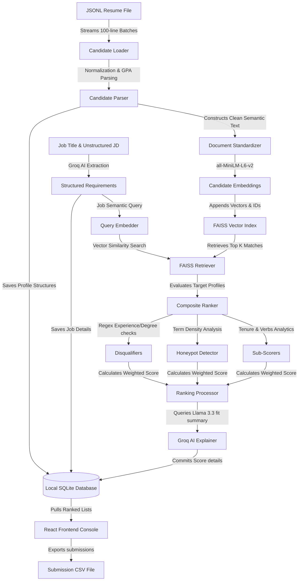

# TalentLens | AI Candidate Ranking & Recruiter Console

TalentLens is a state-of-the-art, local-first AI candidate ranking engine and dashboard. It is engineered to solve the problem of high-volume resume screening by pairing semantic vector search (FAISS) with a multi-dimensional rule-based scoring algorithm, and summarizing candidate fits using Groq LLM.

---

## 📌 Problem Statement
Recruiters reviewing thousands of candidate profiles face three critical bottlenecks:
1. **Semantic Mismatch**: Traditional keyword matching (Boolean search) fails to capture semantic meaning, missing highly qualified candidates who use different synonyms or descriptions.
2. **Cheat Manipulation (Keyword-Stuffing)**: Unqualified candidates manipulate ranking algorithms by copy-pasting required job skills into hidden text blocks (white font, zero-size margins, or summary blocks) to artificially inflate ranking scores.
3. **Inefficient Screening**: Manually evaluating candidate work tenure, growth trajectory, soft skill indicators, and education levels is time-consuming and subjective.

---

## 💡 Our Solution
TalentLens implements a **hybrid semantic-scoring engine**:
1. **Sentence Embeddings + FAISS**: Maps candidate profiles and job requirements into a shared high-dimensional vector space using `sentence-transformers/all-MiniLM-L6-v2` (L2 normalized cosine similarity search), retrieving top matches in milliseconds.
2. **Cheat & Honeypot Detection**: Counts keyword frequencies in profile blocks. If key terms (like `Python`) exceed density benchmarks, the candidate is flagged and heavily penalized (up to -50 points).
3. **Hard Disqualifiers**: Immediately filters out candidates who fail minimum thresholds (e.g., lower degree than required or insufficient years of experience).
4. **Composite Multi-Dimensional Scoring**: Evaluates candidate tenure, behavioral soft skills, degree tier bonuses, and skill match inventories into a single weighted score.
5. **Generative fit Explanations**: Uses Groq AI (Llama 3.3) to draft fit summaries, key highlights, concerns, and tailored interview questions.

---

## 🛠️ Tech Stack

### Backend
* **Core Framework**: FastAPI (Uvicorn web server)
* **Vector Search**: FAISS (Facebook AI Similarity Search)
* **ML Embeddings**: SentenceTransformers (`all-MiniLM-L6-v2` - 90 MB, 384 dimensions, optimized for fast local CPU execution)
* **Database & ORM**: SQLite + SQLAlchemy
* **LLM Engine**: Groq SDK (Llama 3.3 JSON structured outputs)

### Frontend
* **Core Framework**: React 19 + Vite
* **Styling**: Vanilla CSS + Tailwind CSS
* **Design Icons**: Lucide React

---

## 🏗️ System Architecture & Data Flow



---

## ✨ Implemented Work ("What I Have Done")

I have developed and verified the following core application components:
1. **Ingestion & Parser Pipeline**: Streaming generator that reads massive files with $O(1)$ memory footprint, cleaning GPAs, dates, and parsing nested work/education histories.
2. **JD Parser**: Extraction module that maps unstructured text to experience thresholds, skills lists, degree ranks, and target locations using Groq.
3. **FAISS Retrieval Manager**: Fast vector pipeline that builds and updates local indices, matching candidate vectors dynamically.
4. **Hybrid Scoring Engine**: Implementations for Honeypot Keyword Penalities, Disqualifiers, Career TENURE math, Skill Inventories matcher, Behavioral Verb parsers, and Education GPA bonuses.
5. **Interactive Console UI**:
   * Sidebar for managing job openings.
   * File upload panel with active background pipeline progress tracking.
   * Color-coded leaderboards highlighting fit scores, ranks, and disqualification flags.
   * Slide-out side drawer displaying candidate profiles, detailed sub-score breakdowns, and Groq-generated recruiter feedback cards.
   * Export button to download structured submissions directly as a CSV spreadsheet.

---

## 🚀 How to Run Locally

### 1. Prerequisites
Ensure you have the following installed:
* **Python 3.10+**
* **Node.js 18+**

---

### 2. Run the Backend Server

All commands must be executed from the **root directory** of the repository:

1. **Create and Activate Virtual Environment**:
   * **Windows (PowerShell)**:
     ```powershell
     python -m venv .venv
     .venv\Scripts\Activate.ps1
     ```
   * **macOS / Linux**:
     ```bash
     python -m venv .venv
     source .venv/bin/activate
     ```

2. **Install Dependencies**:
   ```powershell
   pip install -r backend/requirements.txt
   ```

3. **Configure Environment Keys**:
   Create a `.env` file inside the `backend/` folder:
   ```env
   GROQ_API_KEY=your_groq_api_key_here
   GROQ_MODEL=llama-3.3-70b-versatile
   DATABASE_URL=sqlite:///./talentlens.db
   ```
   *(Note: The database file will automatically create at `backend/talentlens.db` during server boot).*

4. **Start the FastAPI Backend**:
   Run the following command from the project root:
   ```powershell
   python -m uvicorn backend.main:app --reload --host 127.0.0.1 --port 8000
   ```
   * The API server will start at `http://127.0.0.1:8000/`.
   * You can view interactive endpoints documentation at `http://127.0.0.1:8000/docs`.

---

### 3. Run the Frontend App

Open a **second terminal window** in the root directory:

1. **Navigate to the frontend folder**:
   ```powershell
   cd frontend
   ```

2. **Install frontend dependencies**:
   ```powershell
   npm install
   ```

3. **Start the development server**:
   ```powershell
   npm run dev
   ```
   * The dashboard console will launch at **`http://localhost:5173/`**. Open it in your web browser to start ranking candidates!

---

### 4. Running Backend Test Suites

We have built 24 automated unit and performance integration tests. To run them, execute from the **root directory**:
```powershell
$env:PYTHONPATH="."
.venv\Scripts\pytest
```
All tests should pass successfully in under 3 minutes.
